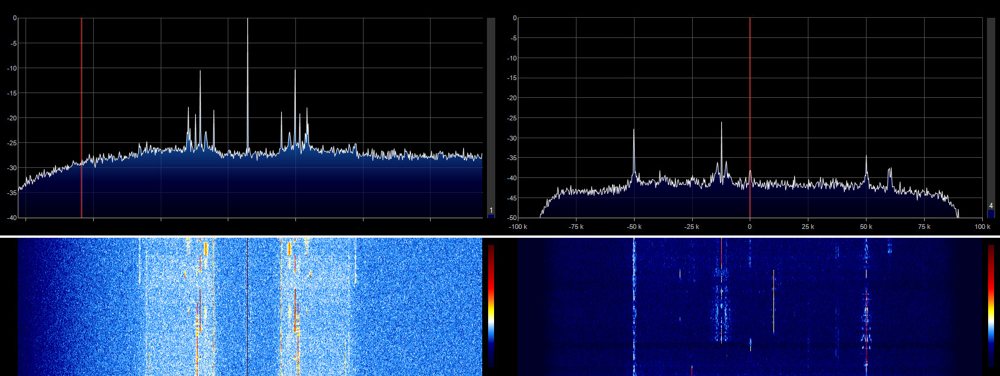
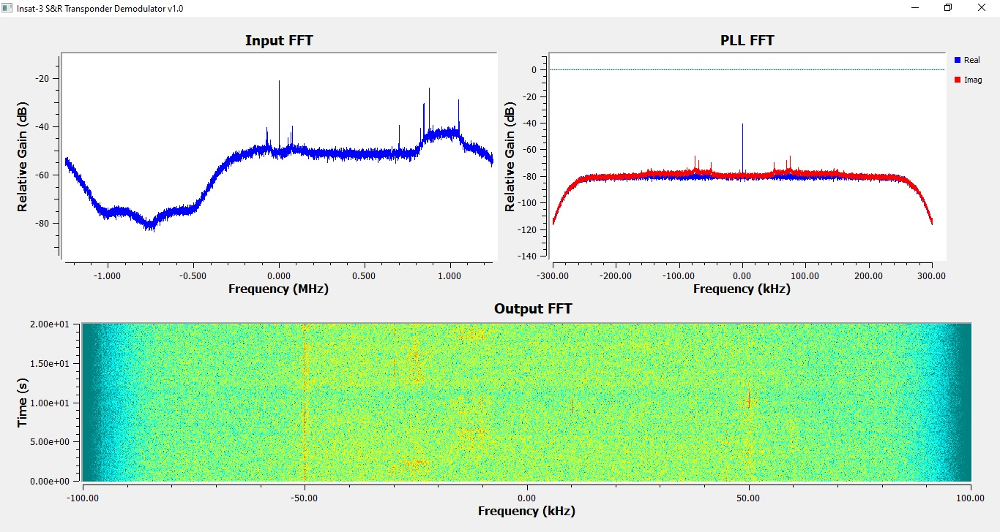

# INSAT-3 S&R Transponder Demodulator

Resamples, stabilizes, and demodulates the C-band 4507 MHz search and rescue transponder downlink from INSAT-3 satellites. See FFT screenshot below, showing the transponder before (double sideband) and after (single sideband demodulated).

  

