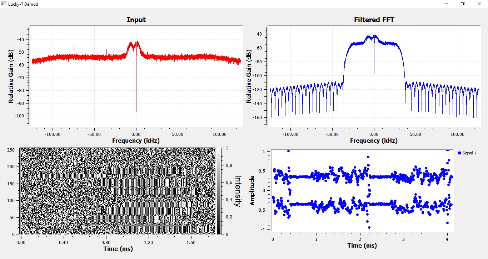

# Lucky-7 Demodulator

Demodulator for the Lucky-7 437.525 MHz GFSK downlink.
The flowchart only demodulates the raw binary data, it does not deframe, descramble, nor decode any real data from it.
See [this](https://github.com/Xerbo/Lucky7-Decoder) repository with a fully functional demod/decode for the images.

