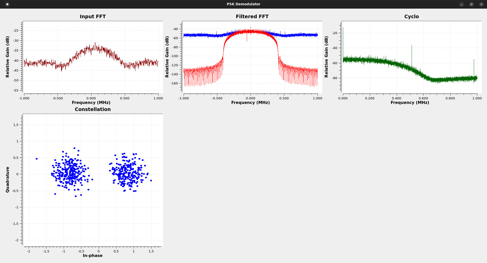

# PSK Demodulator

Generic flowchart for demodulating basic directly phase-modulated digital signals.

### Usage:
- file source block takes 16-bit "SDR#" format wav files
- samp_rate is set to the sample rate of the input baseband file
- costas_bw, modulation, sym_rate and rrc_alpha are set according to the recorded signal
- if sym_rate isn't known, it should be set to a value that is higher than the bandwidth of the analyzed signal, then the cyclostationary analysis frequency sink can be used to determine the correct value
- offset is used if the recording isn't centered at the signal, otherwise it can be set to 0 and its Xlating FFT Filter block can be bypassed (this is done by default, if offset is used then the filter has to be enabled again)
- the Differential Decoder block can be enabled if differential decoding is desired, it is bypassed by default
- some parameters of the flowchart are calculated automatically according to the selected modulation using a Python Module block
- File Sink block after Unpacked to Packed block is the demodulated binary output, File Sink block after the Symbol Sync can be used to write soft symbols, both are disabled by default to allow flowchart testing without (over)writing a file
- in some cases it may be advantageous to swap the Costas Loop and the Root Raised Cosine Filter blocks, so that the RRC comes before the CL, this can help weak signals but may cause issues if the signal is changing frequency (e.g. satellite Doppler shift)

